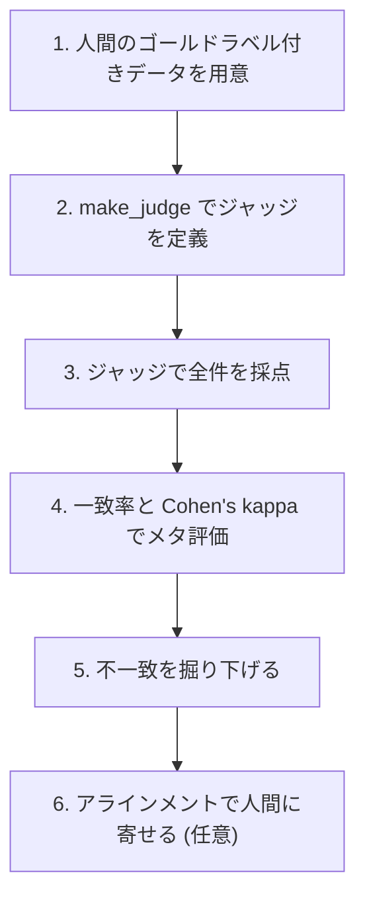

# LLM-as-a-Judgeのメタ評価 (評価器を評価する)

LLM-as-a-Judgeの判定が人間とどれだけ一致しているかを、Databricks + MLflow 3で測る検証用ノートブックと記事です。一致率と Cohen's kappa でジャッジそのものの信頼性を評価し、不一致の分析、さらにジャッジを人間フィードバックへ寄せるアラインメントまでを扱います。

題材はベーカリーのレビュー返信エージェントで、顧客レビューに対する返信が適切か (pass/fail) をジャッジが判定します。

本記事は[『ジャッジを評価するジャッジ ― LLM-as-a-Judgeの信頼性をメタ評価で保証する』](https://qiita.com/taka_yayoi/items/65be4c75b65a6b7363e3) (リポジトリ内 [`meta-evaluation`](https://github.com/taka-yayoi/mlflow-llmops-articles/blob/main/meta-evaluation)) の続編です。基礎編でメタ評価とkappaの考え方を扱い、本編ではその先、不一致の掘り下げとアラインメントに踏み込みます。

## この検証でやること



セクション1から5までが単体で動く最小構成、6のアラインメント (SIMBA) は任意の発展パートです。

## ファイル構成

| ファイル | 内容 |
| --- | --- |
| `meta_eval_llm_judge.ipynb` | 実行済みノートブック (出力つき) |
| `meta_eval_llm_judge.py` | Databricksノートブックソース形式。Workspaceに Import して利用 |

## 前提環境

- Databricks (ノートブックエクスペリメントを使用)
- MLflow 3.4.0以上 (`make_judge` とアラインメント機能に必要)
- アラインメントを試す場合は `dspy` (SIMBAオプティマイザが内部で使用)
- Databricks Foundation Model APIs のエンドポイント (ジャッジ用モデル)

インストールはノートブック先頭のセルで行います。

```python
%pip install --upgrade "mlflow[databricks]>=3.4.0" dspy
dbutils.library.restartPython()
```

## 使い方

1. `meta_eval_llm_judge.py` を Databricks Workspace に Import する (または `.ipynb` をアップロード)
2. `JUDGE_MODEL` を自分の環境の Foundation Model APIs エンドポイントに合わせて変更する
3. 上から順に実行する

ジャッジと採点対象の生成に同じモデルを使うと自己評価バイアス (self-enhancement bias) が入るため、ジャッジには別系統のモデルを選ぶのが定石です。

## 結果のハイライト

16件の検証データでの実行結果です。

- 一致率: 0.812
- Cohen's kappa: 0.636 (Landis & Koch の基準で substantial)

一致率は高く見えますが、偶然の一致を割り引く kappa では印象が一段下がります。不一致3件はすべて「人間=pass、ジャッジ=fail」で、ジャッジの方が厳しめでした。理由を読むとジャッジの方がルーブリックに忠実で、人間ラベルの側を見直すきっかけになる、という結果です。

アラインメント (SIMBA) は前後とも kappa=0.636 で変化せず、16件という小さなデータでは指標が改善しませんでした。人間ラベルが十分に信頼できるゴールドに仕上がって初めてアラインメントが効く、という当たり前の事実を裏付ける結果です。

## 注意点

- アラインメントは実行に時間がかかり、MLflowのバージョンによって挙動が変わることがあります
- `databricks-gpt-oss-120b` などのエンドポイントでは、SIMBA実行中に `REQUEST_LIMIT_EXCEEDED` (トークンのレート上限) に当たることがあります。本格的に回す場合はプロビジョンドスループットのエンドポイントを推奨します

## 参考ドキュメント (日本語)

- カスタムジャッジ (make_judge): https://docs.databricks.com/aws/ja/mlflow3/genai/eval-monitor/custom-judge
- ジャッジを人間のフィードバックと整合させる (align): https://docs.databricks.com/aws/ja/mlflow3/genai/eval-monitor/align-judges
